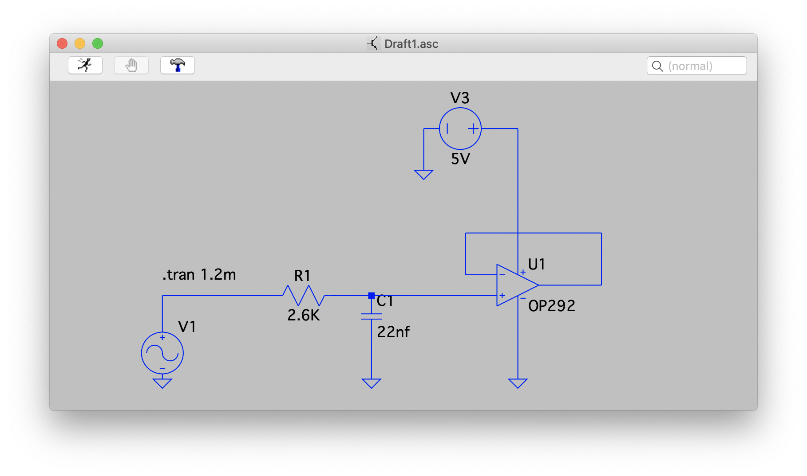

# WebAssembly PWL Generator

Created as a learning exercise in WebAssembly. This is a simple utility for producing Picewise Linear datapoints for use in LTSpice and similar applications to represent sine Waveforms as PWM sources.

Setting up the tool with the following configuration:

(Based on data for the teensy 4.1 microcontroller [PWM Settings](https://www.pjrc.com/teensy/td_pulse.html) )

Will produce an output that when used in this simple circuit in LTSpice

will create th waveform displayed here (green as the ouput for V1 - blue the filtered and buffered output of U1)

## Code
Initially this took the form of a small amount of very simple C++ code to create a command line application that could be quickly used to produce these files by reading in LUTs for the waveforms in different resolutions and pipeing the output to a file used by LTSpice. I was interested in learning about WebAssembly and what is necesary in order to build a program for it and how to set things up in the environment. I've written some detailed notes on this process [on my website](https://alastair.io/).

This repository contains the full code for this simple tool. The dependencies used are JQuery & Bootstrap for UI, and of course EMScripten's `em++` is used for the build.

The interesting files are `calc.js` for the JavaScript and `calc.cpp` for the C++ (and C wrapper) code. The Makefile options for manual em++ compilation should also be helpful.

I don't regularly program in JavaScript, and I have written this code with clarity as the priority - so there will doubtless be numerous efficieny gains to be had, and plenty of bugs...
